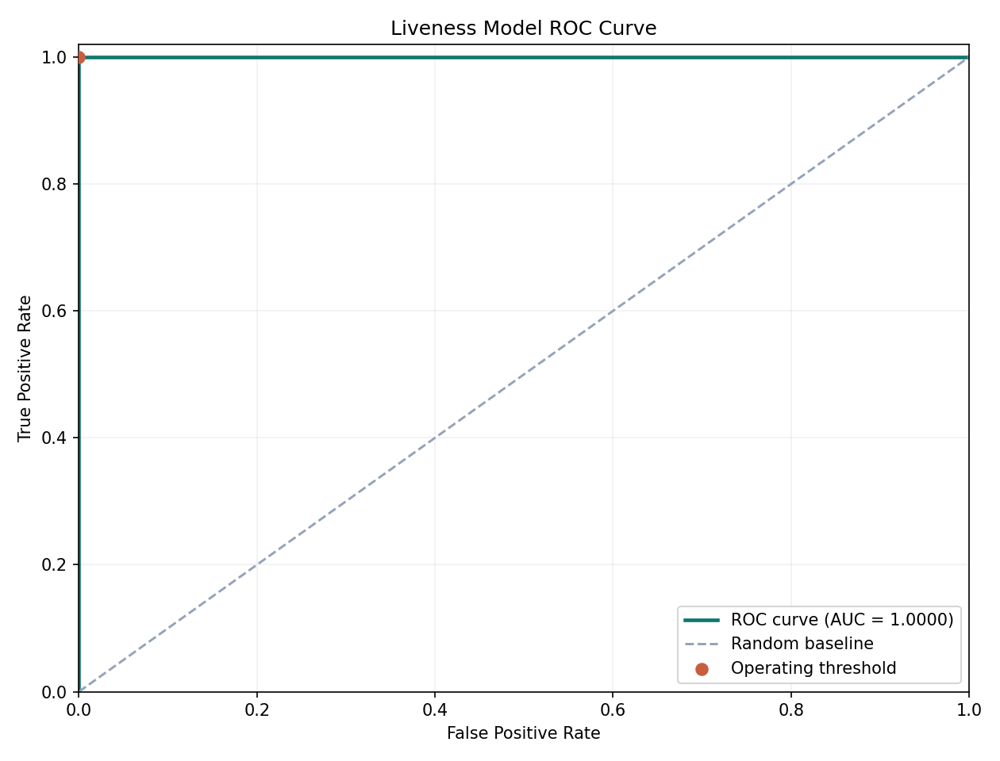
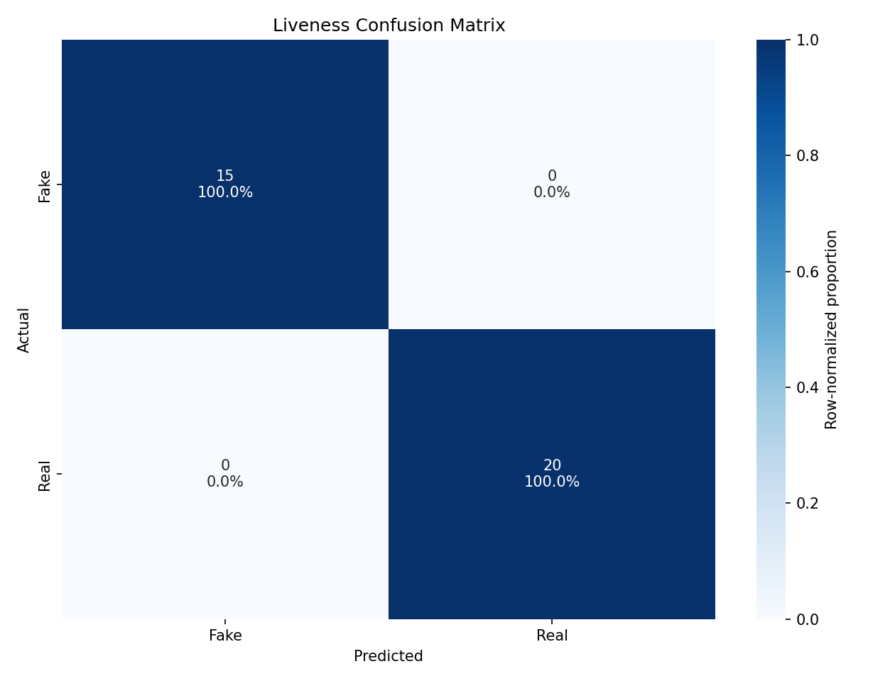

<h1 align="center">📶 SmartAttend 📸</h1>
<h3 align="center">Smart Attendance System with Face Recognition, Liveness Detection & Secure Verification</h3>

<p align="center">
  
  
  
  
  
  
</p>

---

<p align="center">
  <a href="https://smartattend-e4pk3jnsgry5egn8jppsmr.streamlit.app/" target="_blank" rel="noopener noreferrer">
    
  </a>
</p>

<p align="center"><i>🔎 Click the preview above to view the SmartAttend demo workflow.</i></p>

### What You'll See

- 🎓 Student enrollment with face capture
- 🧠 CNN-based face recognition
- 🛡️ Liveness detection against spoof attempts
- ✅ Attendance verification using claimed roll number
- 📊 Attendance logs, attempt logs, and analytics
- 🏫 Role-based academic operations for admins and faculty
- ☁️ Managed Postgres, S3, and Hugging Face deployment support

---

## 🚀 Executive Summary

**SmartAttend** is a **Streamlit-based smart attendance platform** that combines:

- **Face Recognition**
- **Liveness Detection**
- **Session-based attendance workflows**
- **Audit logging and exception review**
- **Managed deployment support**

Traditional attendance systems ask:

> “Did someone mark present?”

SmartAttend asks the better question:

> **“Was the real student physically present, and was the scan genuine for this class session?”**

That is what makes this project stand out.

---

## 🎯 What It Solves

Traditional attendance workflows are weak because they often allow:

- Proxy attendance
- Manual verification overhead
- No verification of physical presence
- No fraud attempt tracking
- Poor auditability
- No controlled session window for specific classes

**SmartAttend fixes this** by combining identity verification, anti-spoofing, session-aware attendance, and structured logging.

---

## 💡 What It Does Now

- Enrolls students with a live face scan and academic details
- Stores records for departments, programs, sections, courses, and offerings
- Supports role-based access for admins and faculty
- Opens attendance only for specific class sessions
- Verifies attendance using claimed roll number plus face scan
- Uses a CNN-based liveness model to reject spoof attempts
- Logs official attendance and separate verification attempts
- Creates reviewable exceptions for mismatches and suspicious scans
- Supports local SQLite for development and managed Postgres for deployment
- Supports local object storage or S3-backed enrolled face assets

---

## 🔁 Core Workflow

1. Admin configures departments, programs, sections, courses, offerings, and faculty access
2. Students are enrolled with face image, roll number, email, year, program, course, and section
3. Face samples are stored and linked to the student record
4. Liveness dataset is collected from real and fake captures
5. Face recognition and liveness models are trained locally
6. Faculty opens a class session for a specific offering
7. Student scans for attendance with the claimed roll number
8. System detects the face, checks identity, runs liveness verification, validates session eligibility, and records the result
9. Failed verification attempts are logged separately and can raise reviewable exceptions
10. Dashboards show student records, attendance summaries, attempt logs, exception queues, and evaluation reports

---

# 🧩 System Architecture

<p align="center">
  <a href="assets/architecture.png">
    
  </a>
</p>

<p align="center"><i>End-to-end SmartAttend pipeline covering enrollment, verification, training, storage, and reporting.</i></p>

---

# 🏗 Architecture Overview

The system follows a modular AI attendance pipeline:

```text
Admin / Faculty
       ↓
Streamlit SmartAttend App
       ↓
Academic Setup + Enrollment + Attendance Verification
       ↓
Face Detection
       ↓
Face Recognition CNN + Liveness Detection CNN
       ↓
Attendance Decision Engine
       ↓
Postgres / SQLite + Attempt Logs + Attendance Logs + Exceptions
       ↓
Dashboard Reports + Evaluation Outputs
```

Separately:

```text
Collected Face Samples
        ↓
Face Training Pipeline
        ↓
Trained Face Recognition Model

Collected Real / Fake Liveness Samples
        ↓
Liveness Training Pipeline
        ↓
Trained Liveness Detection Model
```

---

## 🧠 Key Features

### 1. Anti-Spoofing Liveness Detection
Prevents fake attendance attempts using:
- Printed photos
- Mobile replay attacks
- Non-live image spoofing

### 2. Session-Based Attendance
Attendance is tied to:
- course offering
- class session
- enrolled section
- attendance window

### 3. Dual Logging Architecture
The system stores:
- Official attendance records
- Failed or suspicious verification attempts
- Reviewable exceptions

This creates a much stronger audit trail.

### 4. Role-Based Operations
The system supports:
- Admin operations for platform and academic setup
- Faculty-scoped operations for sessions, attendance, and exception review

### 5. Managed Infrastructure Support
The app supports:
- local SQLite for development
- managed Postgres for hosted deployments
- local object storage or S3 for enrolled face assets
- CI/CD workflows and schema migrations

---

## 🏗 Tech Stack

- Python
- Streamlit
- TensorFlow / Keras
- OpenCV
- NumPy
- Pandas
- SQLite / PostgreSQL
- Matplotlib
- `psycopg`
- `boto3`

---

## 📊 Model Performance

### Liveness Detection Model

Current local evaluation snapshot:

- Evaluation set: `35` liveness samples
- Class split: `15 fake`, `20 real`
- Recalibrated operating threshold: `0.4947`
- Previous threshold before ROC calibration: `0.3000`

| Metric | Value |
|--------|-------|
| Accuracy | `1.0000` |
| Precision | `1.0000` |
| Recall | `1.0000` |
| F1 Score | `1.0000` |
| ROC-AUC | `1.0000` |
| False Acceptance Rate | `0.0000` |
| False Rejection Rate | `0.0000` |

<p align="center">
  <a href="assets/liveness_roc_curve.png">
    
  </a>
</p>

<p align="center"><i>ROC curve for the current local liveness model after threshold recalibration.</i></p>

<p align="center">
  <a href="assets/liveness_confusion_matrix.png">
    
  </a>
</p>

<p align="center"><i>Submission-ready confusion matrix generated from the same evaluation run. Each cell shows count and row-normalized percentage.</i></p>

Notes:

- These results are from the current local liveness dataset and are optimistic because the evaluation set is small.
- The threshold was recalibrated from the ROC curve to correct the earlier overly permissive operating point.

---

## 📂 Project Structure

```text
SmartAttend/
|-- app.py
|-- Dockerfile
|-- requirements.txt
|-- requirements-local.txt
|-- README.md
|-- .env.example
|-- .github/
|   `-- workflows/
|       |-- cd.yml
|       |-- ci.yml
|       `-- deploy-huggingface-space.yml
|-- .streamlit/
|   `-- config.toml
|-- deploy/
|   `-- huggingface/
|       `-- SPACE_README.md
|-- docs/
|   |-- huggingface_space_deployment.md
|   `-- project_blueprint.md
|-- artifacts/
|   `-- .gitkeep
|-- assets/
|   |-- architecture.png
|   |-- demo.gif
|   `-- university_logo.png
|-- data/
|   |-- attendance/
|   |   `-- .gitkeep
|   |-- faces/
|   |   `-- .gitkeep
|   `-- liveness/
|       |-- fake/
|       |   `-- .gitkeep
|       `-- real/
|           `-- .gitkeep
|-- models/
|   `-- .gitkeep
|-- notebooks/
|   `-- README.md
|-- tests/
|   |-- test_postgres_backend.py
|   `-- test_production_features.py
`-- src/
    |-- attendance_logger.py
    |-- attendance_service.py
    |-- collect_faces.py
    |-- config.py
    |-- database.py
    |-- detect_and_mark.py
    |-- enrollment_service.py
    |-- evaluate_models.py
    |-- face_detector.py
    |-- liveness.py
    |-- liveness_dataset_service.py
    |-- migrations.py
    |-- observability.py
    |-- recognizer.py
    |-- security.py
    |-- storage.py
    |-- train_face_model.py
    |-- train_liveness_model.py
    `-- utils.py
```

---

## ⚙️ Setup

1. Copy the example environment file:

```powershell
Copy-Item .env.example .env
```

2. Create a virtual environment and install the full local development stack:

```powershell
python -m venv .venv
.venv\Scripts\Activate.ps1
pip install -r requirements-local.txt
```

3. Initialize or upgrade the schema:

```powershell
python -m src.migrations upgrade
```

4. Start the app:

```powershell
streamlit run app.py
```

---

## 🔑 Environment Configuration

SmartAttend loads configuration from a local `.env` file automatically.

Important variables:

- `SMARTATTEND_ADMIN_USER`
- `SMARTATTEND_ADMIN_PASSWORD`
- `SMARTATTEND_APP_TITLE`
- `SMARTATTEND_INSTITUTION_NAME`
- `SMARTATTEND_DEFAULT_FACULTY_USER`
- `SMARTATTEND_DEFAULT_FACULTY_PASSWORD`
- `SMARTATTEND_DEFAULT_FACULTY_NAME`
- `SMARTATTEND_DATA_DIR`
- `SMARTATTEND_MODELS_DIR`
- `SMARTATTEND_ARTIFACTS_DIR`
- `SMARTATTEND_DATABASE_PATH`
- `SMARTATTEND_DATABASE_URL`
- `SMARTATTEND_STORAGE_BACKEND`
- `SMARTATTEND_STORAGE_ROOT`
- `SMARTATTEND_S3_BUCKET`
- `SMARTATTEND_S3_REGION`
- `SMARTATTEND_S3_PREFIX`
- `AWS_ACCESS_KEY_ID`
- `AWS_SECRET_ACCESS_KEY`
- `AWS_DEFAULT_REGION`
- `SMARTATTEND_FACE_DETECTOR_BACKEND`
- `SMARTATTEND_RECOGNITION_THRESHOLD`
- `SMARTATTEND_LIVENESS_THRESHOLD`
- `SMARTATTEND_FACE_MATCHER_THRESHOLD`
- `SMARTATTEND_SESSION_TIMEOUT_MINUTES`
- `SMARTATTEND_AUTH_MAX_FAILURES`
- `SMARTATTEND_AUTH_RATE_LIMIT_WINDOW_MINUTES`
- `SMARTATTEND_ATTENDANCE_MAX_FAILURES`
- `SMARTATTEND_ATTENDANCE_RATE_LIMIT_WINDOW_MINUTES`

For a new deployment, set a strong admin password before first run.

### Dependency Profiles

- `requirements.txt`: cloud-safe base dependencies
- `requirements-local.txt`: local development, training, Docker runtime parity, and optional object-storage support

Use `requirements-local.txt` whenever you want TensorFlow training, MTCNN, or the full Docker/runtime environment.

---

## 🧪 Training

Train the face recognition model:

```powershell
python -m src.train_face_model --epochs 20
```

Train the liveness model:

```powershell
python -m src.train_liveness_model --epochs 15
```

Run evaluation:

```powershell
python -m src.evaluate_models
```

---

## 🔐 Default Admin Login

- Username: `admin`
- Password: `admin123`

These defaults are intended for local development only. Override them in `.env` or hosted secrets for any real deployment.

---

## ✅ Testing

Run the production-flow tests:

```powershell
python -m unittest discover -s tests -v
```

The Postgres smoke test in `tests/test_postgres_backend.py` runs when `SMARTATTEND_DATABASE_URL` is set.

---

## 🧬 Migrations and Versioning

Print current schema status:

```powershell
python -m src.migrations current
```

Apply the latest schema:

```powershell
python -m src.migrations upgrade
```

Print schema history:

```powershell
python -m src.migrations history
```

---

## 🔒 Privacy and Repository Notes

This repository is intended to store source code and project structure. Personal face images, trained local models, SQLite databases, and generated artifacts are excluded from version control by default.

---

## 📌 Current Scope

- Enrollment-first attendance workflow
- Optional MTCNN detector with Haar fallback
- CNN-based identity recognition
- CNN-based liveness detection
- Session-based attendance with faculty-scoped operations
- Audit logs, login attempt logs, and reviewable exceptions
- SQLite-backed local development plus managed Postgres deployment support
- S3-backed enrolled face assets for hosted environments

---

## ⚠️ Limitations

- Training quality still depends on the size and quality of locally collected datasets
- Liveness robustness depends on collecting varied real and spoof samples
- The recognition pipeline still keeps a local path for training and offline fallback, even when S3 mirroring is enabled
- Free-host deployments such as Hugging Face Spaces may sleep when idle

---

## 🚀 Deployment

### Hosting Decision

- AWS ECS/Fargate remains a valid future target for this container, but it is not the recommended default when the requirement is free hosting.
- The recommended free target for this repo is a public Hugging Face Docker Space backed by managed Postgres and S3.

### Local Deployment

1. Copy `.env.example` to `.env`
2. Set your admin username and a strong admin password
3. Install dependencies with `pip install -r requirements-local.txt`
4. Run `python -m src.migrations upgrade`
5. Start the app with `streamlit run app.py`

### Streamlit Community Cloud

- Main file path: `app.py`
- Use repository-root `requirements.txt`
- This hosted profile is suitable for the operational shell, not full TensorFlow training
- Streamlit Community Cloud is not the intended production target for the full ML runtime

### Hugging Face Spaces

- Recommended free deployment target
- Use a public Docker Space on free `CPU Basic`
- Configure Space secrets for:
  - `SMARTATTEND_ADMIN_USER`
  - `SMARTATTEND_ADMIN_PASSWORD`
  - `SMARTATTEND_DATABASE_URL`
  - `SMARTATTEND_STORAGE_BACKEND=s3`
  - `SMARTATTEND_S3_BUCKET`
  - `SMARTATTEND_S3_REGION`
  - `SMARTATTEND_S3_PREFIX`
  - `AWS_ACCESS_KEY_ID`
  - `AWS_SECRET_ACCESS_KEY`
  - `AWS_DEFAULT_REGION`
- Deployment guide and exact secret checklist: [docs/huggingface_space_deployment.md](docs/huggingface_space_deployment.md)
- GitHub workflow: [.github/workflows/deploy-huggingface-space.yml](.github/workflows/deploy-huggingface-space.yml)

### Docker Deployment

Build the image:

```powershell
docker build -t smartattend .
```

Run the container with persistent data, model, and artifact mounts:

```powershell
docker run --rm -p 8501:8501 --env-file .env -v "${PWD}\\data:/app/data" -v "${PWD}\\models:/app/models" -v "${PWD}\\artifacts:/app/artifacts" smartattend
```

Notes:

- The host-mounted `data` directory preserves the SQLite database and collected face/liveness samples
- The host-mounted `models` directory preserves trained models
- The host-mounted `artifacts` directory preserves evaluation plots and reports
- The container installs `requirements-local.txt`, runs `python -m src.migrations upgrade`, and then starts Streamlit

### Managed Postgres

Set:

- `SMARTATTEND_DATABASE_URL=postgresql://<user>:<password>@<host>:5432/<database>`

If `SMARTATTEND_DATABASE_URL` is set, the app uses Postgres instead of the local SQLite file.

### S3 Object Storage

Set:

- `SMARTATTEND_STORAGE_BACKEND=s3`
- `SMARTATTEND_S3_BUCKET=<bucket-name>`
- `SMARTATTEND_S3_REGION=<aws-region>`
- `SMARTATTEND_S3_PREFIX=smartattend`
- standard AWS credentials such as `AWS_ACCESS_KEY_ID` and `AWS_SECRET_ACCESS_KEY`

Enrolled face assets are uploaded to S3 and can be loaded back from S3 for runtime fallback recognition.

### AWS ECS/Fargate

- The container is compatible with ECS/Fargate, but this is a paid path rather than the recommended free target.
- If you later move to ECS/Fargate, keep the same `SMARTATTEND_DATABASE_URL` and S3 configuration and deploy the existing container image from GHCR.

---

## 🔁 CI/CD

GitHub Actions now includes:

- `.github/workflows/ci.yml`
  - compiles the code
  - runs the SQLite test suite
  - runs schema upgrade locally
  - runs Postgres migration and smoke coverage against a GitHub Actions Postgres service
- `.github/workflows/cd.yml`
  - builds and pushes a Docker image to GitHub Container Registry
  - optionally applies `python -m src.migrations upgrade` against a managed Postgres database if `SMARTATTEND_DATABASE_URL` is configured as a repository secret
- `.github/workflows/deploy-huggingface-space.yml`
  - optionally mirrors the repo to a Hugging Face Docker Space when `HF_TOKEN` and `HF_SPACE_ID` are configured as repository secrets

Recommended GitHub secrets for CD:

- `SMARTATTEND_DATABASE_URL`
- `HF_TOKEN`
- `HF_SPACE_ID`
- any deployment-system secrets needed by your target platform

---

## 📈 Scalability & Production Considerations

- Multi-classroom expansion
- Role-based access control
- Better attendance session modeling
- Stronger spoof datasets for real-world robustness
- Managed database and object storage already supported
- Potential use of embeddings and vector similarity search for larger deployments
- Hosted deployment paths for Hugging Face, Docker platforms, and future ECS/Fargate rollout

This project can grow from a classroom demo into a more production-oriented biometric attendance platform.

---

## 👥 Authors

<table align="center">
  <tr>
    <td align="center" width="220">
      <b>Mitra Boga</b><br/><br/>
      <a href="https://www.linkedin.com/in/bogamitra/">
        
      </a>
      <a href="https://x.com/techtraboga">
        
      </a>
    </td>
    <td align="center" width="220">
      <b>Sindhura Peri</b><br/><br/>
      <a href="https://www.linkedin.com/in/gayathri-sindhura-peri-1a995b282/">
        
      </a>
      <a href="https://github.com/sindhuraperii">
        
      </a>
    </td>
  </tr>
</table>

---

## 📄 License

This project is licensed under the MIT License. See [LICENSE](LICENSE).

---

> This repository demonstrates a real-world AI-powered attendance verification system using face recognition, liveness detection, secure logging, class-session attendance controls, and a modular Streamlit-based workflow.
